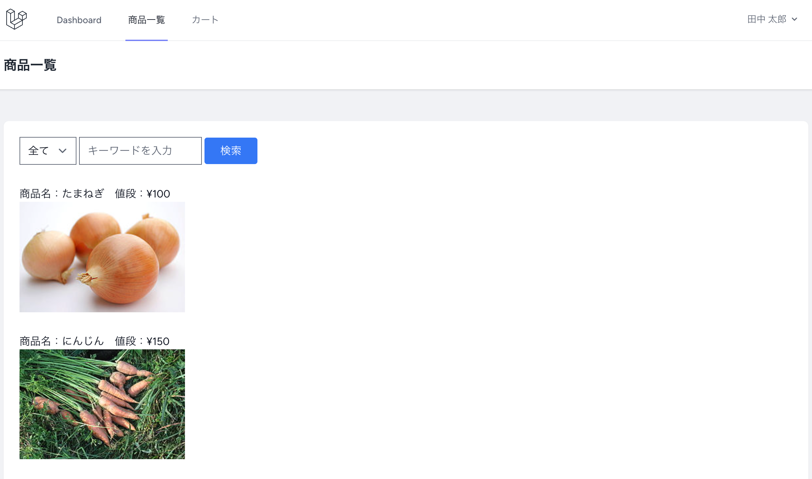
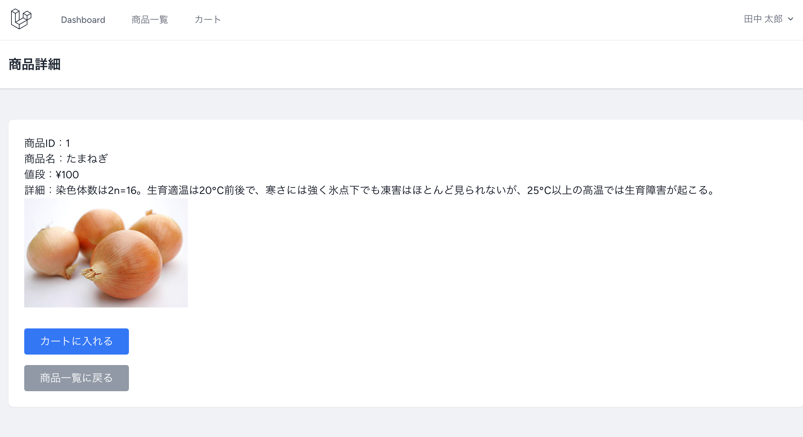
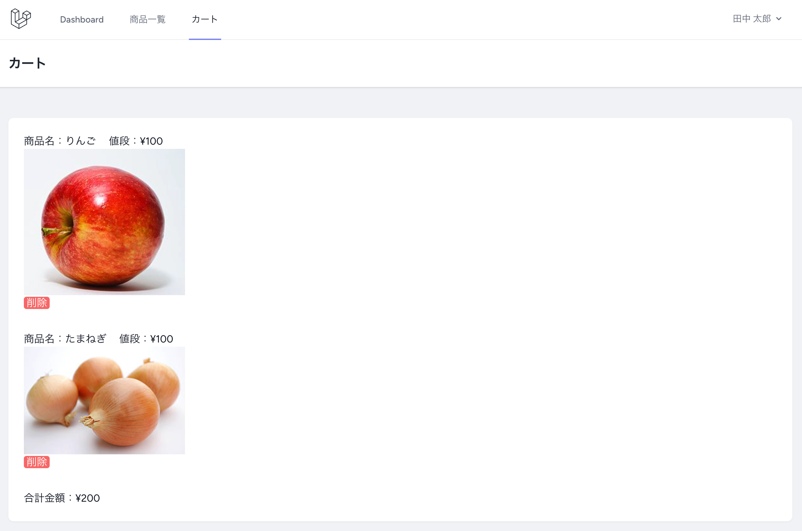
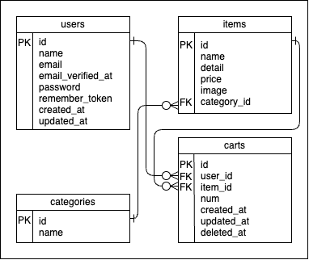

# lara_shop_10

# 概要

Laravel を用いた、簡易な EC サイトである。デプロイは行わない。

# 使用画面イメージ

## 商品一覧



## 商品詳細



## カート



# 使用技術

-   フロントエンド
    -   HTML
    -   CSS
        -   TailwindCSS 3.1.0
-   バックエンド
    -   PHP 8.1 以上
        -   Laravel 10
-   その他
    -   MAMP または XAMPP
    -   Visual Studio Code

# 機能一覧

-   商品関連
    -   商品一覧
        -   カテゴリー検索（野菜、飲料、果物という 3 つのカテゴリーで絞り込みが可能。）
        -   キーワード検索（入力されたキーワードをもとに、商品名及び商品の詳細情報から部分一致検索を行う。）
    -   商品詳細
-   カート関連
    -   カートに入れる
    -   カートを見る
    -   カート内の商品を削除（論理削除（ソフトデリート）。）
-   認証関連
    -   アカウント登録
    -   ログイン
    -   ログアウト
    -   プロフィール

# 環境構築

## GitHub からダウンロードする場合

-   `git clone https://github.com/yuuhei-koutoku/lara_shop_10.git`で GitHub からソースコードをダウンロードする。
-   `cd lara_shop_10`
-   `composer install` または `composer update` （プロジェクトの依存関係を`composer.lock`に基づいてインストールまたは更新する。）
-   `npm install` （`package.json`ファイルに基づいてプロジェクトのフロントエンド依存関係をインストールする。）
-   `cp .env.example .env` （`.env.example`をコピーして`.env`を作成する。）
-   .env の下記の内容を、自身の環境に合わせて変更する。
    ```
    DB_CONNECTION=mysql
    DB_HOST=127.0.0.1
    DB_PORT=3306 または 8889
    DB_DATABASE=
    DB_USERNAME=
    DB_PASSWORD=
    ```
-   XAMPP または MAMP でデータベースを起動した後に、`php artisan migrate:fresh --seed`を実行する。（データベースにテーブルとダミーデータが追加されれば OK。）
-   `php artisan key:generate`を実行してキーを生成する。
-   `php artisan serve` と `npm run dev` で簡易サーバーを立ち上げ、表示確認をする。

## 圧縮ファイルからダウンロードする場合

-   圧縮ファイルをダウンロードする。
-   圧縮ファイルを解凍する。
-   解凍したファイルを XAMPP または MAMP の htdocs 直下に配置する。
-   圧縮ファイルを削除する。
-   `cd path/to/lara_shop_10` （プロジェクトのルートディレクトリに移動する。）
-   `composer update` （`composer.json`に記載された依存関係を最新のバージョンにアップデートし、`composer.lock`ファイルを更新する。）
-   `npm update` （`package.json`に記載されたフロントエンド依存関係を最新のバージョンにアップデートする。）
-   .env の下記の内容を、自身の環境に合わせて変更する。
    ```
    DB_CONNECTION=mysql
    DB_HOST=127.0.0.1
    DB_PORT=3306 または 8889
    DB_DATABASE=
    DB_USERNAME=
    DB_PASSWORD=
    ```
-   XAMPP または MAMP でデータベースを起動した後に、`php artisan migrate:fresh --seed`を実行する。（データベースにテーブルとダミーデータが追加されれば OK。）
-   `php artisan serve` と `npm run dev` で簡易サーバーを立ち上げ、表示確認をする。

### トラブルシューティング

-   `composer update` が失敗する場合

    -   `composer -V` （composer が正しくインストールされていることを確認する。）
        -   バージョンが確認できない場合は、composer がインストールされていない、もしくはパスが通っていない恐れがある。
    -   `cd path/to/lara_shop_10` （プロジェクトのルートディレクトリに移動する。）
    -   `rm -rf vendor` （`vendor`を削除する。）
    -   `rm composer.lock` （`composer.lock`を削除する。）
    -   `composer install` （`composer.json`で指定された依存関係をインストールする。）

-   `npm update` が失敗する場合
    -   `npm -v` （npm が正しくインストールされていることを確認する。）
        -   バージョンが確認できない場合は、npm がインストールされていない、もしくはパスが通っていない恐れがある。
    -   `cd path/to/lara_shop_10` （プロジェクトのルートディレクトリに移動する。）
    -   `rm -rf node_modules` （`node_modules`を削除する。）
    -   `rm package-lock.json` （`package-lock.json`を削除する。）
    -   `npm install` （`package.json`で指定された依存関係をインストールする。）
    -   `npm run dev` （フロントエンドのアセット(JavaScript, CSS 等)を開発モードでコンパイル(変換)する。）

# ER 図


